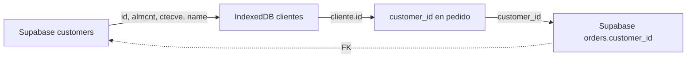

# SOLUCIÓN - Campo ID en Tabla Clientes

## 🔍 Problema Identificado

La tabla `clientes` en IndexedDB **NO tenía el campo `id`** que es la llave primaria de Supabase. Esto causaba problemas porque:

1. **No se podía establecer la relación** entre `orders.customer_id` y `customers.id`
2. **La sincronización fallaba** porque faltaba el `customer_id` correcto
3. **Los pedidos no se podían asociar** correctamente con los clientes

## ✅ Cambios Implementados

### 1. **Consulta de Supabase Actualizada**
```javascript
// ANTES (en client-operations.js):
.select('almcnt, ctecve, name')

// AHORA:
.select('id, almcnt, ctecve, name') // ⭐ Incluye el ID de Supabase
```

### 2. **Estructura IndexedDB Actualizada**
```javascript
// ANTES: clientes en IndexedDB tenían:
{
  almcnt: 2033,
  ctecve: 54,
  name: "SAN FRANCISCO OZOLOTEPEC"
}

// AHORA: clientes en IndexedDB tienen:
{
  id: 123,              // ⭐ NUEVO: ID de Supabase
  almcnt: 2033,
  ctecve: 54,
  name: "SAN FRANCISCO OZOLOTEPEC"
}
```

### 3. **Funciones de IndexedDB Actualizadas**
- ✅ `cacheClients()` - Valida y guarda el campo `id`
- ✅ `getClientsLocal()` - Retorna clientes con `id`
- ✅ `searchClientsByName()` - Busca clientes con `id`
- ✅ `findClientByCode()` - Encuentra cliente con `id`

### 4. **Hook useClientesLocal Actualizado**
- ✅ Valida que los clientes tengan el campo `id`
- ✅ Maneja selección de clientes con `id`

### 5. **Helpers para Clientes**
Nuevo archivo `clientHelpers.js` con funciones:
- `getClientSupabaseId()` - Obtiene ID de Supabase
- `validateClientStructure()` - Valida estructura completa
- `prepareClientForOrder()` - Prepara cliente para usar en pedidos
- `debugClientInfo()` - Debug de información de cliente

## 🔄 Flujo de Relación Corregido



## 🧪 Cómo Probar los Cambios

### 1. **Limpiar y recargar clientes**
Necesitas **volver a descargar** los clientes para que incluyan el campo `id`:
```javascript
// En DevTools Console:
// 1. Limpiar clientes existentes (sin ID)
await clearClientsForAlmacen(2033)

// 2. Recargar clientes con ID
await downloadAndCacheClients(2033)
```

### 2. **Verificar estructura de clientes**
```javascript
// En DevTools Console:
const clientes = await getClientsLocal(2033)
console.log('Clientes con ID:', clientes[0])
// Debe mostrar: { id: 123, almcnt: 2033, ctecve: 54, name: "..." }
```

### 3. **Probar helper de cliente**
```javascript
// Importar en DevTools:
import { debugClientInfo } from './src/utils/clientHelpers.js'

// Probar con un cliente:
const cliente = await findClientByCode(2033, 54)
debugClientInfo(cliente)
```

## ⚠️ **IMPORTANTE - Datos Existentes**

### Los clientes ya descargados NO tienen el campo `id`

Si ya tienes clientes en IndexedDB, necesitas:

1. **Limpiar la tabla clientes** actual
2. **Volver a descargar** desde Supabase

**Comando para limpiar y recargar:**
```javascript
// En DevTools Console:
import { clearClientsForAlmacen } from './src/utils/indexedDB.js'
import { downloadAndCacheClients } from './src/utils/client-operations.js'

// Limpiar clientes existentes
await clearClientsForAlmacen(2033)

// Recargar con ID incluido
await downloadAndCacheClients(2033)

console.log('✅ Clientes recargados con ID de Supabase')
```

## 📋 Archivos Modificados

- ✅ `src/utils/client-operations.js` - Consulta incluye `id`
- ✅ `src/utils/indexedDB.js` - Funciones manejan campo `id`
- ✅ `src/hooks/useClientesLocal.js` - Valida campo `id`
- ✅ `src/utils/supabaseFieldMapping.js` - Validación mejorada
- ✅ `src/utils/clientHelpers.js` - **NUEVO** - Helpers para clientes

## 🎯 Estado Actual

✅ **Consulta corregida** - Incluye `id` de Supabase  
✅ **IndexedDB actualizado** - Maneja campo `id`  
✅ **Validaciones agregadas** - Verifica estructura completa  
⚠️ **Datos existentes** - Necesitan recarga para incluir `id`  

## 🚨 Próximos Pasos

1. **Ejecutar limpieza y recarga** de clientes
2. **Verificar que clientes tengan `id`**
3. **Crear un pedido de prueba** con cliente que tenga `id`
4. **Habilitar sincronización** y probar que funcione

## 💡 Beneficios de la Solución

- ✅ **Relación correcta** entre pedidos y clientes
- ✅ **Sincronización funcional** con `customer_id` válido
- ✅ **Estructura consistente** entre local y Supabase
- ✅ **Validaciones robustas** para prevenir errores
- ✅ **Debugging mejorado** con helpers especializados 