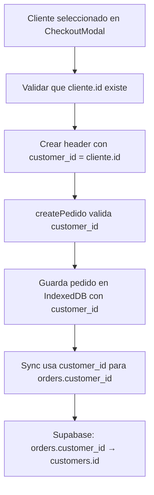

# IMPLEMENTACIÓN COMPLETADA - Campo customer_id en Pedidos

## ✅ **Cambios Realizados**

### 1. **Función `createPedido` Actualizada**
- ✅ **Validación agregada**: Verifica que `customer_id` esté presente y sea numérico
- ✅ **Campo incluido**: El `customer_id` se guarda en la tabla pedidos de IndexedDB
- ✅ **Documentación actualizada**: Incluye ejemplo de uso

**Ubicación**: `src/utils/indexedDB.js`

```javascript
// ANTES: Solo validaba header y items
export async function createPedido(header, items) {
  if (!header || !Array.isArray(items) || items.length === 0) {
    throw new Error('Header y items son requeridos')
  }
  // ...
}

// AHORA: Valida que customer_id esté presente
export async function createPedido(header, items) {
  if (!header || !Array.isArray(items) || items.length === 0) {
    throw new Error('Header y items son requeridos')
  }

  // ⭐ VALIDAR que customer_id esté presente
  if (!header.customer_id || typeof header.customer_id !== 'number') {
    throw new Error('customer_id es requerido y debe ser el ID de Supabase del cliente')
  }
  // ...
}
```

### 2. **CarritoModal Actualizado**
- ✅ **Validación del cliente**: Verifica que el cliente tenga ID de Supabase
- ✅ **Campo incluido en header**: Pasa `customer_id` al crear el pedido

**Ubicación**: `src/components/CarritoModal.jsx`

```javascript
// ANTES: Header sin customer_id
const header = {
  almcnt: orderData.almcnt,
  ctecve: orderData.cliente.ctecve,
  ctename: orderData.cliente.name,
  user_id: userId,
  total_amount: totalAmount,
  notes: ''
}

// AHORA: Header con customer_id
const header = {
  customer_id: orderData.cliente.id,  // ⭐ NUEVO: ID de Supabase del cliente
  almcnt: orderData.almcnt,
  ctecve: orderData.cliente.ctecve,
  ctename: orderData.cliente.name,
  user_id: userId,
  total_amount: totalAmount,
  notes: ''
}
```

## 🔗 **Flujo Completo de Relación**



## 📋 **Estructura de Datos Actualizada**

### **Pedido en IndexedDB (AHORA)**
```javascript
{
  id: 1,                    // Auto-generado
  customer_id: 123,         // ⭐ NUEVO: ID de Supabase del cliente
  almcnt: 2033,
  ctecve: 54,
  ctename: "CLIENTE EJEMPLO",
  user_id: "user_temp",
  total_amount: 100.50,
  notes: "",
  status: "pending",
  sync_status: "pending",
  created_at: 1234567890,
  updated_at: 1234567890
}
```

### **Relación con Supabase**
```javascript
// IndexedDB pedido.customer_id (123) 
//     ↓
// Supabase orders.customer_id (123)
//     ↓ 
// Supabase customers.id (123) ← FOREIGN KEY
```

## ⚠️ **Requisitos Previos**

Para que esto funcione correctamente:

1. **Los clientes DEBEN tener el campo `id`**:
   ```bash
   # Ejecutar recarga de clientes primero
   reloadAlmacen2033()
   ```

2. **Estructura del cliente esperada**:
   ```javascript
   {
     id: 123,              // ⭐ REQUERIDO: ID de Supabase
     almcnt: 2033,
     ctecve: 54,
     name: "CLIENTE EJEMPLO"
   }
   ```

## 🧪 **Cómo Probar**

### 1. **Verificar clientes tienen ID**
```javascript
// En DevTools Console:
const clientes = await getClientsLocal(2033)
console.log('Cliente ejemplo:', clientes[0])
// Debe mostrar: {id: 123, almcnt: 2033, ctecve: 54, name: "..."}
```

### 2. **Crear pedido de prueba**
1. Agregar productos al carrito
2. Ir a checkout
3. Seleccionar un cliente
4. Confirmar pedido
5. Verificar en DevTools que el pedido tiene `customer_id`

### 3. **Verificar pedido creado**
```javascript
// En DevTools Console:
const pedidos = await getPendingPedidosDeep()
console.log('Último pedido:', pedidos[0])
// Debe mostrar customer_id: 123
```

## 🚨 **Errores Esperables y Soluciones**

### Error: "customer_id es requerido y debe ser el ID de Supabase del cliente"
**Causa**: El cliente seleccionado no tiene campo `id`
**Solución**: Recargar clientes con `reloadAlmacen2033()`

### Error: "El cliente seleccionado no tiene ID de Supabase"
**Causa**: Cliente sin campo `id` o con valor inválido
**Solución**: Volver a descargar clientes desde Supabase

## ✅ **Estado Actual**

- ✅ **Campo customer_id implementado** en tabla pedidos
- ✅ **Validaciones agregadas** en createPedido y CarritoModal
- ✅ **Relación establecida** para sincronización con Supabase
- ⏸️ **Pendiente**: Recargar clientes para que tengan ID
- ⏸️ **Pendiente**: Probar creación de pedido con customer_id

## 🎯 **Siguientes Pasos**

1. **Recargar clientes** para que tengan campo `id`
2. **Crear pedido de prueba** para verificar que funciona
3. **Habilitar sincronización** y probar que el customer_id se mapea correctamente
4. **Validar en Supabase** que la relación funciona

---

🎉 **¡La implementación del campo customer_id está COMPLETADA!** 

Ahora los pedidos incluyen correctamente el ID del cliente de Supabase para establecer la relación necesaria en la sincronización. 